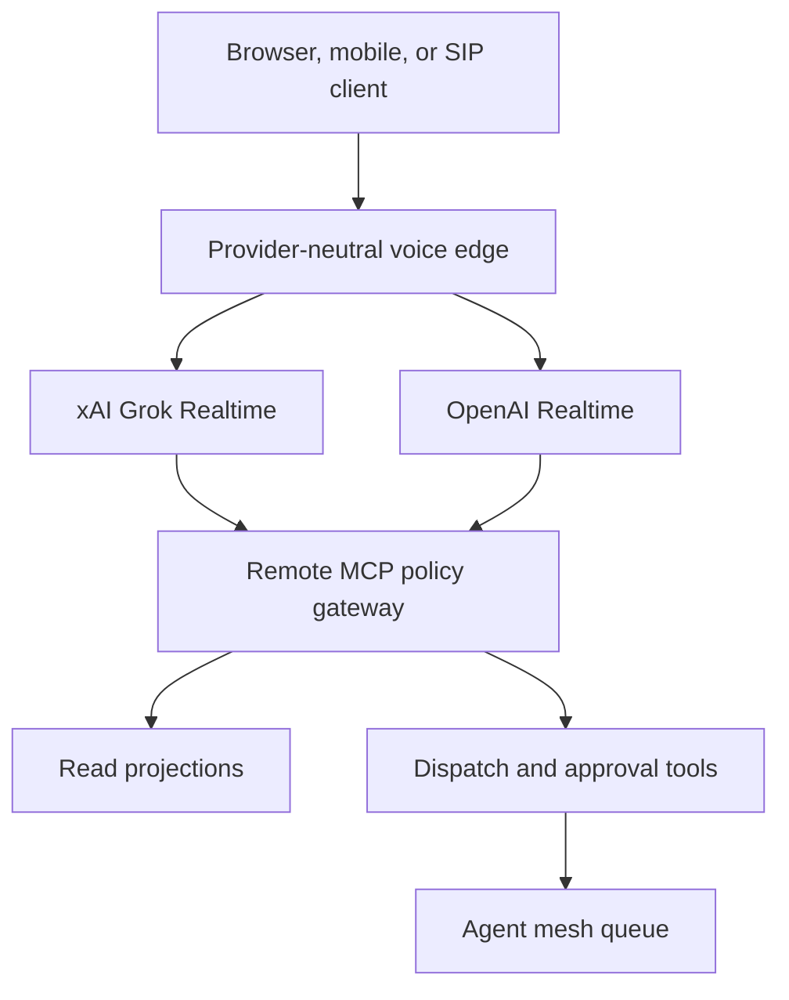

# Voice Edge, MCP Gateway, and Provider Bake-Off

**Status:** Accepted target architecture
**Date:** 2026-08-30
**Supersedes:** provider-specific implementations that couple voice transport directly to business tools.

## Decision

Use three deliberately separate surfaces:

1. **`grok-operator`** is the authenticated browser/mobile PWA and the fastest path to daily use.
2. **`starlight-voice`** remains the local Windows PTT/Tauri operator; it is not the cloud relay or phone backend.
3. **Lobe Chat** remains a secondary text/model lab while it earns or loses its place through use. Do not add Open WebUI during the bake-off.

xAI Grok speech-to-speech is the primary voice lane because Frank prefers its conversational presence and the current API supports low-latency WebSocket audio, tool use, remote MCP, ephemeral browser tokens, and SIP. OpenAI Realtime is the A/B and fallback lane. Both providers must consume the same provider-neutral session policy, MCP allowlist, tool schemas, and turn receipt.

## Architecture

## The voice agent is not Hermes

Hermes remains the durable worker. The voice edge must never wait for Hermes to complete a long repository task inside a speech turn.

- read-only status and memory queries execute synchronously through the remote MCP gateway;
- long work calls `dispatch_task` and receives an immediate task ID;
- consequential operations call `request_approval`; the spoken model cannot self-approve;
- Hermes or a laptop worker completes the task and publishes a `RunReceipt`;
- the next voice session, notification, or operator view surfaces the result.

This produces one durable task history regardless of whether the request started in Grok, OpenAI, Lobe Chat, Telegram, n8n, or the command center.

## Allowed remote tools for the first release

| Tool | Mode | Purpose |
|---|---|---|
| `portfolio_status` | read | Current ventures, gates, and blockers |
| `recent_run_receipts` | read | What agents completed or failed |
| `node_health` | read | Laptop/cloud worker availability |
| `sis_recall_projection` | read | Reviewed, privacy-filtered durable memory |
| `project_context` | read | Repository and Notion decision references |
| `dispatch_task` | prepare/write | Queue a typed asynchronous job |
| `request_approval` | prepare/write | Open an approval record; never execute the action |

No raw private vault tool, shell, filesystem, GitHub write, email send, deployment mutation, payment, or publishing tool is exposed directly to the speech model.

## Client authentication

- Browsers and mobile clients obtain short-lived provider tokens from the Starlight voice edge.
- Provider API keys never enter client code.
- The voice edge maps authenticated identity to a `VoiceSessionPolicy`.
- Anonymous sessions are read-only, duration capped, and use a separate budget.
- Public SIP webhooks terminate at the cloud edge and validate signatures before opening a provider session.

## Phone number sequence

Do not begin with a phone number. Prove the same tool and receipt contract in browser sessions first. After the provider bake-off passes:

1. provision or connect a number through a SIP carrier;
2. route inbound SIP to the selected provider or a thin SIP router;
3. retain the browser policy and tool gateway unchanged;
4. record call consent and transcript policy before durable capture.

xAI supports Direct SIP/BYO trunk connections but does not provision phone numbers through its API. OpenAI also supports SIP transports. A dual-provider phone router is justified only after the browser bake-off shows persistent value.

## Memory and transcript policy

- Default durable record: compact transcript summary + turn receipts, not raw audio.
- Raw audio is off unless the session declares a benchmark, consented oral history, or production-asset purpose.
- Remote recall sees only the signed read-only SIS summary projection.
- Private relationship, health, finance, credentials, and raw-chat vaults are unreachable.
- Every extracted decision retains session, turn, tool, and artifact provenance.

## Provider bake-off

Run the fixed corpus in `benchmarks/voice/provider-bakeoff-v1.json` with the same:

- system instructions;
- MCP allowlist and schemas;
- user identity and memory projection;
- network region where possible;
- interruption and noisy-audio fixtures;
- session budget.

Score:

| Dimension | Weight | Gate |
|---|---:|---:|
| Correct tool choice and arguments | 30% | >=95% |
| Conversational presence / desire to continue | 20% | Frank rating >=4/5 |
| First playable audio | 15% | P50 <=800ms; P95 <=1500ms |
| Interruption recovery | 10% | >=95% |
| Exact names, repos, amounts, and dates | 10% | >=95% |
| Approval and privacy compliance | 10% | 100% |
| Cost per successful outcome | 5% | reported, no hard gate initially |

Grok remains primary unless it fails a hard gate. OpenAI becomes the primary lane only when it materially beats Grok on tool completion or safety while preserving the preferred conversational experience.

## Implementation order

1. Validate `VoiceSessionPolicy` and `VoiceTurnReceipt` at every session/turn boundary.
2. Add cloud endpoints for short-lived xAI and OpenAI client credentials.
3. Implement the seven-tool remote MCP gateway with explicit allowlists.
4. Wire `grok-operator` to xAI and OpenAI provider adapters.
5. Capture turn receipts and dispatch IDs without storing raw audio by default.
6. Run the fixed corpus and publish provider comparison receipts.
7. Only then wire the winning adapter into local `starlight-voice` PTT.
8. Add SIP after seven days of successful daily browser use.

## Production gates

- 100% write-like requests either create an approval record or are refused.
- 0 private-path or credential material appears in provider-visible context.
- 20 consecutive provider sessions close with complete turn/session receipts.
- 95% correct read-tool selection and exact structured arguments.
- 7 days of daily PWA use before SIP investment.
- No claim that `starlight-voice` is a working voice assistant until microphone-to-first-audio is measured against live providers.